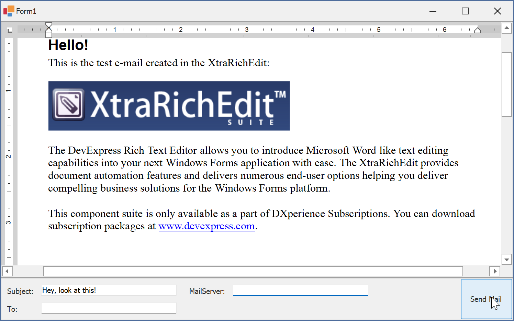

<!-- default badges list -->

<!-- default badges end -->

# Rich Text Editor for WinForms - Build a Mail Application with the RichEditControl

This example illustrates how to use the RichEditControl to create a simple mail application that sends a loaded document in HTML format. The [System.Net.Mail.MailMessage](https://learn.microsoft.com/en-us/dotnet/api/system.net.mail.mailmessage?view=net-7.0) class methods are used to create a message. The message is sent with the help of the [System.Net.Mail.SmtpClient](https://learn.microsoft.com/en-us/dotnet/api/system.net.mail.smtpclient?view=net-7.0) class instance.

# Implementation Details

* Convert the loaded document into the HTML formatted stream. Use the [GetHtmlText](https://docs.devexpress.com/OfficeFileAPI/DevExpress.XtraRichEdit.API.Native.SubDocument.GetHtmlText.overloads?p=netframework) method to retrieve the loaded document as HTML formatted content.
* You can use the [IUriProviderService](https://docs.devexpress.com/OfficeFileAPI/DevExpress.Office.Services.IUriProviderService) interface implementation to embed images as linked resources.

* Handle the [BeforeExport](https://docs.devexpress.com/WindowsForms/DevExpress.XtraRichEdit.RichEditControl.BeforeExport?p=netframework) event to specify the required encoding and create a [System.Net.Mail.AlternateView](https://learn.microsoft.com/en-us/dotnet/api/system.net.mail.alternateview?view=net-7.0) object required for HTML email format.

<!-- default file list -->
# Files to Look At

* [Form1.cs](./CS/RichEditSendMail/Form1.cs) (VB: [Form1.vb](./VB/RichEditSendMail/Form1.vb))
<!-- default file list end -->

# More Examples

* [How to Export the RichEditControl Document into an Outlook Mail Item](https://github.com/DevExpress-Examples/how-to-export-the-richeditcontrol-document-into-an-outlook-mail-item-e4438)
